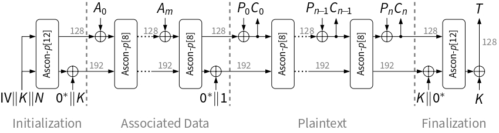
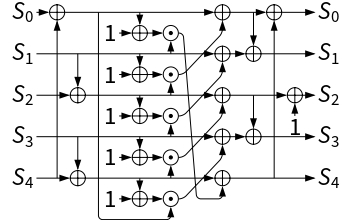

# Side Channel Attacks to Ascon by Using Chipwhisperer Husky

## Introduction

This is a forked repository from [this link](https://github.com/newaetech/chipwhisperer). Purpose of this repo is conducting side channel attacks by capturing power traces of ASCON cryptographic algorithm running on 32bit ARM chip and getting the private key by analyzing those traces. All of the development is done on the develop branch of this repository. All of the files added to this repository can be found in **./chipwhisperer/firmware/mcu/semester-project-ascon** path. Files can be categorized into 5 groups as ASCON implementation files, test files, firmware file, trace analysis files and executable files. Purpose and content of those files will be explained in the next chapter.

## Files

### Ascon Implementation

ascon.c and ascon.h files are used to implement ASCON 128 cryptographic algorithm which is specified in [this link](https://ascon.isec.tugraz.at/specification.html). This implementation only includes encrypt and decrypt functions (AEAD) and not the hash function because of the purpose of the semester project. Parameters and lengths of these parameters are like this: key: 128 bit, nonce: 128 bit, tag: 128 bit, rate: 128 bit, capacity: 128 bit, IV: 64 bit. Here is the figure that shows steps of this algorithm works  In this project, initialization phase and specifically substitution layer is targeted for side channel attacks because the key directly interacts with the Nonces in this layer which creates an attack surface. Here is the illustration of the substitution layer of ASCON. 

### Firmware
To run ASCON implementation on the target chip (Chipwhisperer Husky), firmware is implemented in **simpleserial-ascon.c**. There are two functions as **get_key** and **get_nonce**. **get_key** sets the key of ASCON to the given input. **get_nonce** sets the nonce of ASCON to the given input and runs only **first permutation** of the 12 permutations of initialization phase. There are multiple reasons for this implementation:
1. We focus on the first iteration of the permutation because key and nonce directly interact in this phase
2. Running just the first phase of permutation instead of running whole ASCON reduces runtime and saves lots of time during trace collection.
3. Just running the first permutation makes trace analysis easier.

Ascon round runs between **trigger_high()** and **trigger_low()** to trigger Chipwhisperer to collect traces. In the main function of the code, **get_key** and **get_nonce** are added as commands are registered so that those commands can be used to run ASCON.

### Makefile and Executables
Makefile is created to compile the firmware with ascon implementation to run it on target. Makefile implementation of simpleserial-aes is used as reference for the code. To run the makefile, use this command:
```bash
make PLATFORM=CWHUSKY CRYPTO_TARGET=NONE
```
This command will create executable files such as .bin, .hex, .eep, .elf and human readable analysis files such as .lss, .map, .sym. **.hex** file is used to execute code on target and **.lss** file is used to examine


### Test

To determine correctness of my ascon implementation, KAT (Known Answer Test) is used. KAT file is created by following the instructions in official implementation of ASCON. Test cases are stored in **ascon_cpa_dataset.txt** file, there are 1000 different test cases. To test ascon implementation, a **test_ascon.c** script is used. This file takes input from the txt file, feeds those input to the encryption and decryption functions of ASCON, and compares ciphertext and plaintext with given ciphertext and plaintext. Given ASCON implementation successfully passed 1000 tests. To run test, use these commands:
```bash
gcc test_ascon.c ascon.c -o test
./test
```

To ensure ascon running on target (Chipwhisperer Husky) successfully, **target_test.py** Python script is used. This script get executable of the firmware (simpleserial-ascon-CWHUSKY.hex) and loads it to the target. After that, it runs KAT verification by using specified functions in the firmware. After the optimization to collect high volume of traces, some functions in firmware is removed and **target_test.py** is not working because it is not possible to set plaintext and AD anymore. This has become an obsolute file in current implementation.

### Analysis

Jupyter notebook is used for analysis (dpa_ascon.ipynb). It is composed of 6 parts: setup of target, r8 register implementation, trace collection, CPA attack to find K0_low, CPA attack to find K0_high, Pearson Correlation graph.
1. **Setup of Target**: First part of the Jupyter loads the .hex file created by Makefile to the target, sets initial parameters and restart Chipwhisperer. 
2. **R8 Register Implementation:**: The r8 register performs **bic** instruction on k0_low and IV_low ^ N1_low. Target is 32 bit chip and it handles 64 bits parts of key (K0, K1) by separating them as low and high to the registers. This register keeps k0_low & (~(iv_low ^ n1_low)). IV is constant, Nonces are known and our goal is the key so this is a perfect attack surface. To exploit it, operation done on r8 register implemented on Python.
3. **Collecting 500.000 Traces**: To conduct side channel attack, we need huge amount of traces to decrease the effect of the noise on our analysis. 500.000 traces collected for the attack which takes approximately 4 hours. Ascon runs it first round of its 12 permutations in initial phase with the same key and random nonces every time. In each iteration, traces are collected and stored with hypothetical hamming weight calculated which is hamming weight of r8 function, key, nonce and trace.
4. **CPA Attack to find k0_low**: k0 low is 32 bit and I attacked 16 bits (2 bytes) at a time. It is a long for loop that processes 500000 traces so I did some optimizations before the loop such as pre-computing trace statistics and pre-processing nonces. In for loop, I calculated calculated the pearson correlation between hamming weight of hypothetical r8 leakage and traces and ranked those correlations from highest to lowest. In the end, result matched with the real k0_low.
5. **CPA Attack to find k0_high**: Same attack conducted on k0_high. Found keys were dramatically different than the real key. Possible reasons are: wrong implementation, initial value of register different than 0.
6. **Pearson Correlation Graph**
This is the graph that shows pearson correlation between traces and hamming weight of hypothetical leakage to determine traces synchronized or not. There are 1000 graphs with 1000 traces each. It shows that all of the graph has the same spikes so we can conclude that target is synchronized

## Summary
Ascon and firmware are successfully implemented and tested.  Traces collected from the target, synchronization of traces tested with comparing graph of traces with different keys. Side channel attack conducted on K0_low and K0_high by using Pearson correlation. K0_low was found successfully while K0_high was not found.


